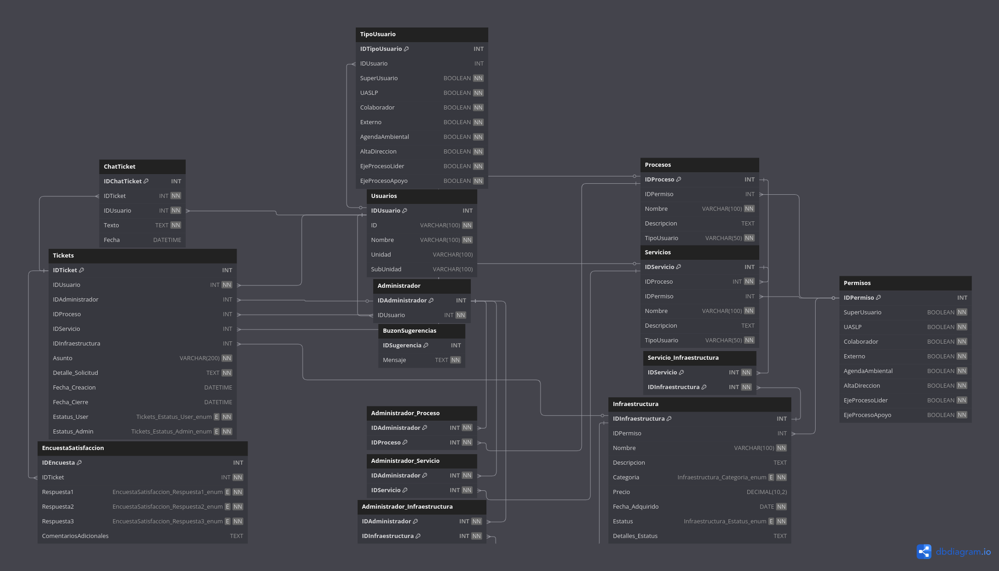
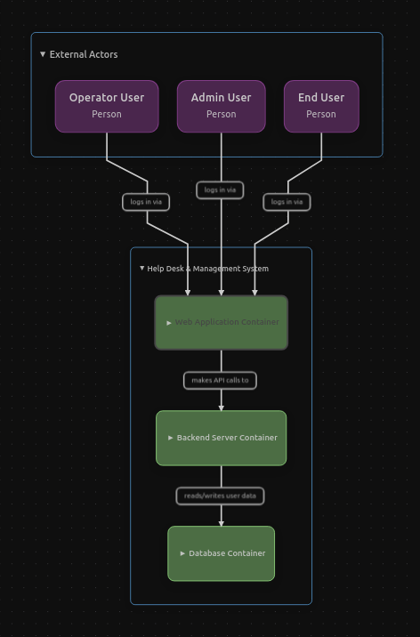
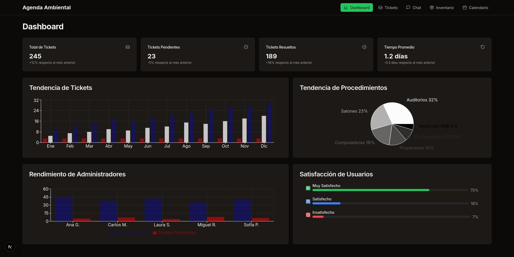
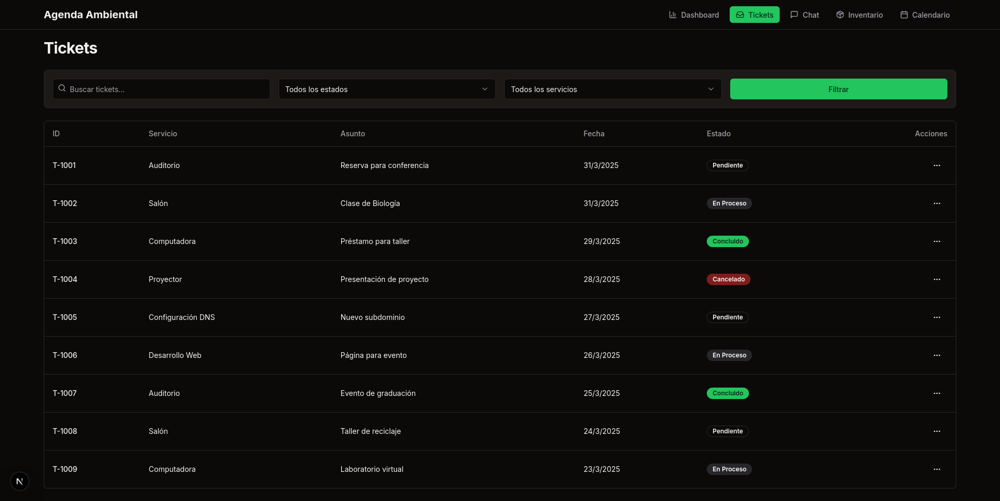
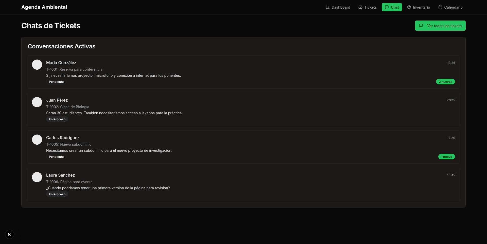
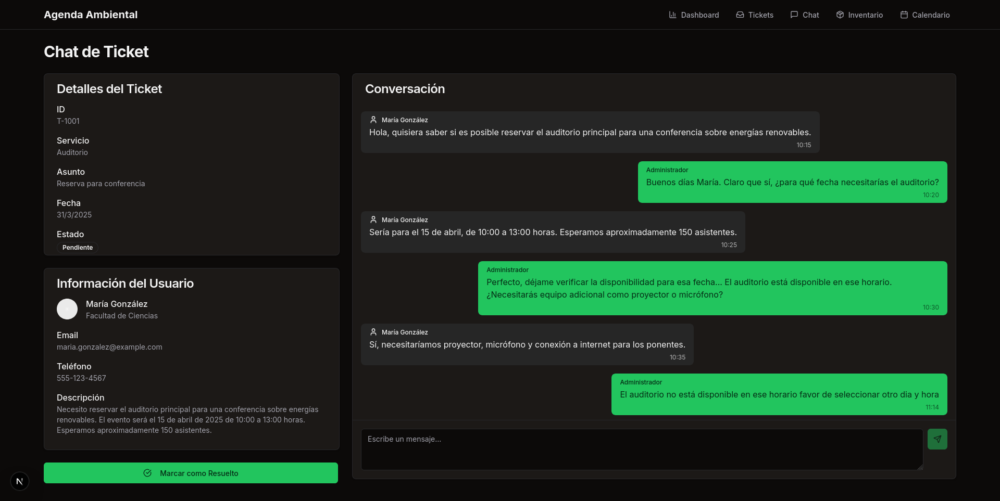
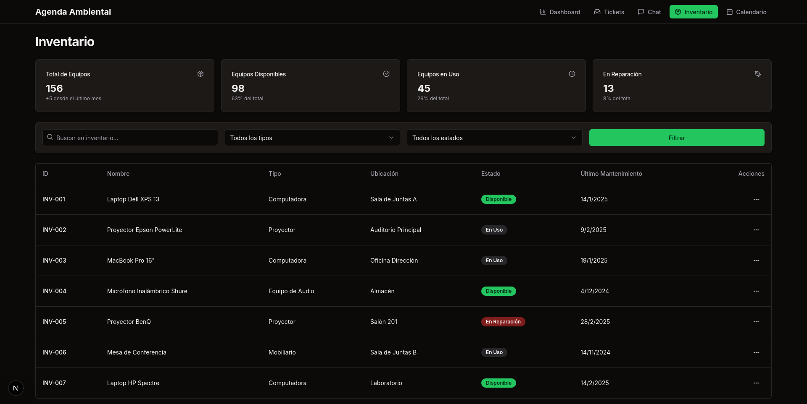

# Servicio-Atencion-Usuarios-TIC-3.0

Este proyecto es una aplicación web desarrollada como parte del servicio social en la Agenda Ambiental. Su objetivo es mejorar la gestión de recursos, servicios técnicos y solicitudes de usuarios mediante un sistema integral y automatizado.

---

## 📌 Resumen

La aplicación permite a usuarios registrar solicitudes (tickets) según su perfil. Los tickets se gestionan con un sistema de mensajería directa entre usuarios y administradores, y se cierran mediante una confirmación mutua. Posteriormente, se solicita al usuario una encuesta de satisfacción. También se incluye un buzón anónimo de sugerencias.

---

## 🛠️ Estructura del Sistema

* **Jerarquía funcional:**
  * **Procesos** → agrupan uno o más **Servicios**
  * **Servicios** → pueden requerir **Infraestructura**
* **Gestión por perfiles de usuario:**
  Roles definidos por permisos booleanos en la base de datos (`TipoUsuario`), adaptables a múltiples combinaciones por usuario.

---

## 🧠 Características Principales

* Solicitud de servicios mediante tickets
* Sistema de mensajería interna en cada ticket
* Evaluación post-servicio vía encuesta de satisfacción
* Buzón anónimo de sugerencias
* Asignación automática de tickets según carga de trabajo y permisos
* Panel de administración para gestión de procesos, servicios e infraestructura

---

## 🗃️ Base de Datos

Diseñada en MySQL con relaciones normalizadas para:

* Gestión de usuarios y roles (`Usuarios`, `TipoUsuario`)
* Control de accesos (`Permisos`)
* Asignación granular de administradores
* Ciclo completo de tickets y comunicación (`Tickets`, `ChatTicket`)
* Evaluación del servicio (`EncuestaSatisfaccion`)
* Canal abierto de retroalimentación (`BuzonSugerencias`)

  <h3>📊 Modelo de Base de Datos</h3>
  
  
<em>Estructura completa de la base de datos con todas las relaciones y entidades del sistema</em>

  <h3>🔄 Diagrama de Flujo del Sistema</h3>
  
  
<em>Flujo de procesos y arquitectura general del sistema de atención a usuarios</em>

---

## 💻 FrontEnd

Se contemplan tres enfoques de desarrollo:

1. **Laravel + HTML/CSS/JS** (Enfoque clásico)
   Simple, rápido y con buen rendimiento.

2. **Laravel Blade + React + ShadCN UI + Tailwind CSS** (Enfoque híbrido)
   Balance entre interactividad moderna y renderizado tradicional.

3. **Laravel + Next.js + React + ShadCN UI + Tailwind CSS** (SPA desacoplada)
   Arquitectura escalable y modular con experiencia fluida.

---

## 🖼️ Interfaces del Sistema

### 🔐 Pantalla de Acceso

  <h4>Inicio de Sesión</h4>
  
  
<em>Interfaz principal para el acceso al sistema con autenticación segura</em>

---

### 👨‍💼 Panel de Administrador - Versión HTML/CSS/JS

  <h4>Dashboard Principal</h4>
  
  
<em>Vista general del panel administrativo con métricas y estadísticas</em>

  <h4>Dashboard - Análisis de Rendimiento</h4>
  
  
<em>Análisis detallado de rendimiento y KPIs del sistema</em>

  <h4>Dashboard - Resumen Ejecutivo</h4>
  
  
<em>Resumen ejecutivo con indicadores clave y tendencias</em>

  <h4>Gestión de Tickets</h4>
  
  
<em>Panel de administración de tickets con filtros y estados en tiempo real</em>

  <h4>Sistema de Chat por Ticket</h4>
  
  
<em>Interfaz de comunicación directa con usuarios para resolución de incidencias</em>

  <h4>Gestión de Operadores</h4>
  
  
<em>Panel de administración de personal técnico y asignación de roles</em>

  <h4>Detalles de Operador</h4>
  
  
<em>Vista detallada del perfil y rendimiento individual de cada operador</em>

  <h4>Control de Inventario</h4>
  
  
<em>Sistema de gestión de recursos e infraestructura tecnológica</em>

  <h4>Calendario de Actividades</h4>
  
  
<em>Planificación y seguimiento de mantenimientos y servicios programados</em>

---

### 👤 Panel de Usuario - Versión HTML/CSS/JS

  <h4>Dashboard del Usuario</h4>
  
  
<em>Panel principal del usuario con acceso rápido a servicios y estado de solicitudes</em>

  <h4>Formulario de Solicitudes</h4>
  
  
<em>Interfaz intuitiva para la creación de nuevas solicitudes de servicio técnico</em>

  <h4>Solicitud de Instalaciones</h4>
  
  
<em>Formulario especializado para solicitudes de instalación de equipos e infraestructura</em>

  <h4>Mis Tickets</h4>
  
  
<em>Vista de todas las solicitudes del usuario con seguimiento de estado en tiempo real</em>

  <h4>Chat de Soporte</h4>
  
  
<em>Sistema de mensajería directa con el personal técnico asignado</em>

  <h4>Encuesta de Satisfacción</h4>
  
  
<em>Evaluación del servicio recibido para mejora continua del sistema</em>

---

### ⚛️ Panel de Administrador - Versión React

  <h4>Dashboard Moderno</h4>
  
  
<em>Interfaz moderna desarrollada en React con componentes interactivos y responsivos</em>

  <h4>Gestión de Tickets Avanzada</h4>
  
  
<em>Panel avanzado de tickets con filtros dinámicos y actualizaciones en tiempo real</em>

  <h4>Lista de Conversaciones</h4>
  
  
<em>Vista organizada de todas las conversaciones activas con usuarios</em>

  <h4>Chat Individual</h4>
  
  
<em>Interfaz de chat moderna con historial completo y funciones avanzadas</em>

  <h4>Inventario Digital</h4>
  
  
<em>Sistema digital de inventario con búsqueda avanzada y categorización automática</em>

  <h4>Calendario Interactivo</h4>
  
  
<em>Calendario interactivo con gestión de eventos y recordatorios automáticos</em>

---
